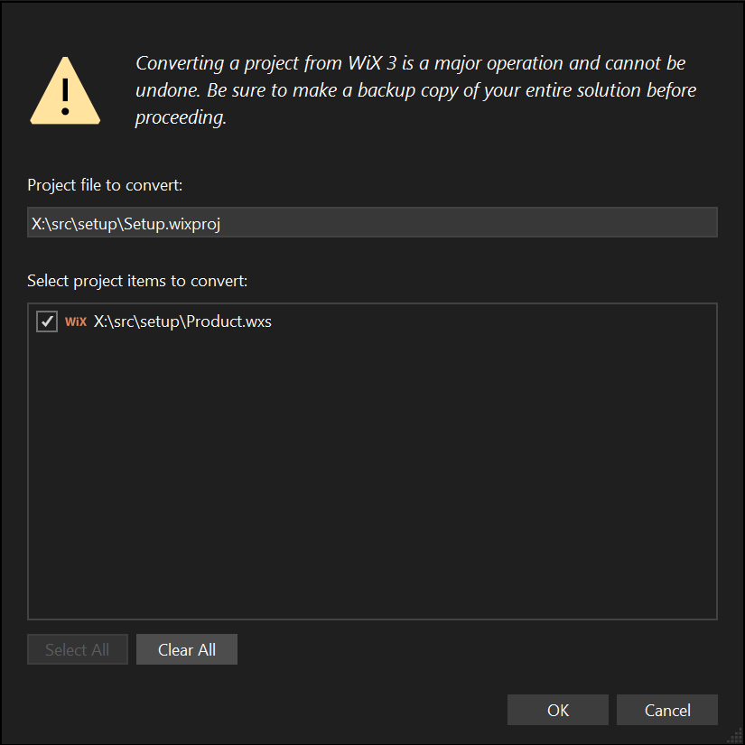

# WiX v4 for WiX v3 users

:::info
TODO: WiX v4 documentation is under development.
:::
 
A lot about WiX has changed between v3 and v4 but the nuts and bolts of authoring .wxs files will appear very similar. Here are some higher-level things that have changed:

- WiX v4 doesn't have to be installed on every dev machine and build image like WiX v3. Instead, WiX v4 follows the modern .NET model of using NuGet to deliver tools.
  - WiX v4 MSBuild projects are SDK-style projects; MSBuild and NuGet work together to bring down the WiX v4 MSBuild SDK NuGet package.
  - Both .NET Framework MSBuild and `dotnet build` are supported.
  - To build packages from the command line, WiX v4 is available as a .NET tool, which is also a NuGet package.
  - WiX extensions are delivered as NuGet packages, which are usable from both MSBuild projects via `PackageReference` and the WiX .NET tool.
- For command-line afficionados, most executables have been merged into a single `wix.exe` tool with commands. For example, in WiX v3, you might build by calling Candle.exe one or more times to compile your authoring and then calling Light.exe to link and bind the compiled authoring into an .msi package. In WiX v4 using `wix.exe`, that's one command: `wix build -o product.msi product.wxs`.

The WiX v4 language has some simplifications and uses a new namespace, so WiX v3 authoring needs to be converted. Luckily, there's an app for that.


## Convert WiX authoring from the command line

To convert WiX v3 authoring to WiX v4 from the command line, first install the [WiX .NET tool](intro.md#nettool). Then you can run `wix convert`:

:::tip
By default, `wix convert` converts the files in place, overwriting the original files. You can add the `--dry-run` switch to have `wix convert` report on what changes it would make without actually making them. Of course, your setup source code is in version control, so you can always easily revert the changes `wix convert` makes. I mean, it is in version control, right?!
:::

- To convert an individual WiX source file: `wix convert path\to\file.wxs`.
- To convert all WiX source files in a specified directory: `wix convert path\to\*.wxs`.
- To convert all WiX source, include, and localization files in a specified directory: `wix convert path\to\*.wx?`.
- To convert all WiX source, include, and localization files in a specified directory tree: `wix convert --recurse path\to\*.wx?`.


## Convert WiX projects and authoring from Visual Studio

[FireGiant](https://www.firegiant.com/)'s [HeatWave Community Edition][heatwave] includes support for converting WiX v3 authoring (like using `wix convert`) and converting WiX v3 .wixproj MSBuild projects to SDK-style WiX v4 projects.



[HeatWave Community Edition is available free of charge.][heatwave]


## Conversion FAQ {#faq}

### Converting the `Component/@Win64` attribute

In WiX v3 authoring out in the wild, it's common to find code similar to the following:

```xml
<?if $(var.Platform) = "x64"?>
  <?define IsWin64 = yes ?>
  <?define ProgramFilesFolder = ProgramFiles64Folder ?>
<?elseif $(var.Platform) = "x86" ?>
  <?define IsWin64 = no ?>
  <?define ProgramFilesFolder = ProgramFilesFolder ?>
<?elseif $(var.Platform) ~= "Arm64" ?>
  <?define IsWin64 = yes ?>
  <?define ProgramFilesFolder = ProgramFiles64Folder ?>
<?endif?>
```

and then repeated use of the `IsWin64` preprocessor variable:

```xml
<Component ... Win64="$(var.IsWin64)">
```

WiX v3 didn't require repeated use of the `Win64` attribute. First noted in [the historical record back in 2010](https://www.joyofsetup.com/2010/05/14/working-hard-or-hardly-working/#manually-marking-package-and-component-bitness), WiX automatically marks components according to the architecture specified when compiling them. WiX v4 continues that trend and replaces the `Win64` attribute with the clarifying `Bitness` attribute to make it possible to override the default.

WiX v3 didn't have a solution for the root Program Files folder id. WiX v4 introduces the new "standard" directory `ProgramFiles6432Folder` to solve that problem. `ProgramFiles6432Folder` automatically resolves to `ProgramFilesFolder` for an x86 package and `ProgramFiles64Folder` for an x64 or Arm64 package.

For example:

```xml
<Fragment>
  <StandardDirectory Id="ProgramFiles6432Folder">
    <Directory Id="CompanyFolder" Name="!(bind.Property.Manufacturer)">
      <Directory Id="INSTALLFOLDER" Name="!(bind.Property.ProductName)" />
    </Directory>
  </StandardDirectory>
</Fragment>
```

All this logic works off the platform you specify at build time, with with the `-arch` switch at the wix.exe command line or the equivalent MSBuild property `InstallerPlatform`.


### Converting custom action ids

In WiX v4's extensions, custom action ids were renamed from their WiX v3 origins for two reasons:

1. To support WiX v4's platform-specific custom actions for all three platforms that WiX v4 supports: x86, x64, and Arm64.
2. To avoid conflicts when building a package with WiX v4 that merges a merge module that was built with WiX v3 and uses WiX v3 extension custom actions. (Yes, this is an annoying edge case.)

WiX v4 meets these requirements by adding a prefix that lets us version custom actions when they make changes that are incompatible with prior versions. Today, the prefix is `Wix4` (because the WiX team is full of wildly imaginitive people). In WiX v5, if a particular extension made a change that was incompatible with the custom tables produced by WiX v4, that extension would adopt a new prefix, perhaps something like `Wix5`. But fixes and changes that are backward compatible would not require changing the prefix.

The suffix distinguishes platforms:

| Platform | Suffix |
| -------- | ------ |
| x86 | `_X86` |
| x64 | `_X64` |
| Arm64 | `_A64` |

For example, the `QueryNativeMachine` custom action in WiX v3 is, in WiX v4, named:

- `Wix4QueryNativeMachine_X86`
- `Wix4QueryNativeMachine_X64`
- `Wix4QueryNativeMachine_A64`

Some custom actions already have a `Wix` prefix. For those, the new prefix replaces it. So, for example, the `WixFailWhenDeferred` custom action in WiX v3 is now named:

- `Wix4FailWhenDeferred_X86`
- `Wix4FailWhenDeferred_X64`
- `Wix4FailWhenDeferred_A64`

Generally, this change is invisible because the extension handles the prefix and suffix for you. That was also true in WiX v3, but several custom actions, like [WixFailWhenDeferred](../v3/customactions/wixfailwhendeferred/) did not have a custom element in the extension. Usually, this was because there was no additional information required. In WiX v4, there's always at least one bit of additional information required: the platform the package is being built for. So WiX v4 includes custom elements like [FailWhenDeferred](../reference/schema/util/failwhendeferred/) to include custom actions in your package so you don't have to worry about prefixes and suffixes.

Other references to WiX custom actions must use the full id, including prefix and suffix.


### Converting custom WixUI dialog sets


[heatwave]: https://www.firegiant.com/wix/heatwave/
